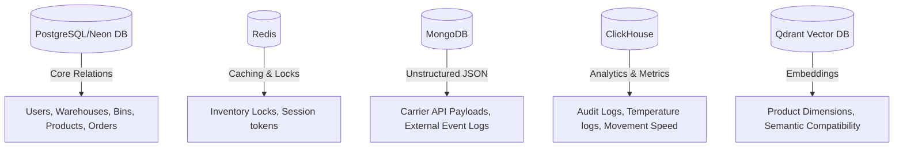

# Database Design

Our architecture uses a multi-database approach optimized for high performance, analytical scale, unstructured logs, and vector operations.

## Relational Schema (PostgreSQL)

### 1. `users_user`
- `id` (UUID, PK)
- `username` (VARCHAR)
- `email` (VARCHAR)
- `role` (ENUM: ADMIN, MANAGER, STAFF)

### 2. `warehouses_warehouse`
- `id` (UUID, PK)
- `code` (VARCHAR, Unique)
- `name` (VARCHAR)
- `address` (TEXT)

### 3. `zones_zone`
- `id` (UUID, PK)
- `warehouse_id` (FK to warehouse)
- `code` (VARCHAR)
- `zone_type` (ENUM: DRY, COLD, HAZARDOUS)

### 4. `racks_rack`
- `id` (UUID, PK)
- `zone_id` (FK to zone)
- `code` (VARCHAR)

### 5. `bins_bin`
- `id` (UUID, PK)
- `rack_id` (FK to rack)
- `code` (VARCHAR)
- `max_weight` (DECIMAL)
- `max_volume` (DECIMAL)

### 6. `products_product`
- `id` (UUID, PK)
- `sku` (VARCHAR)
- `name` (VARCHAR)
- `dimensions` (JSON)
- `weight` (DECIMAL)
