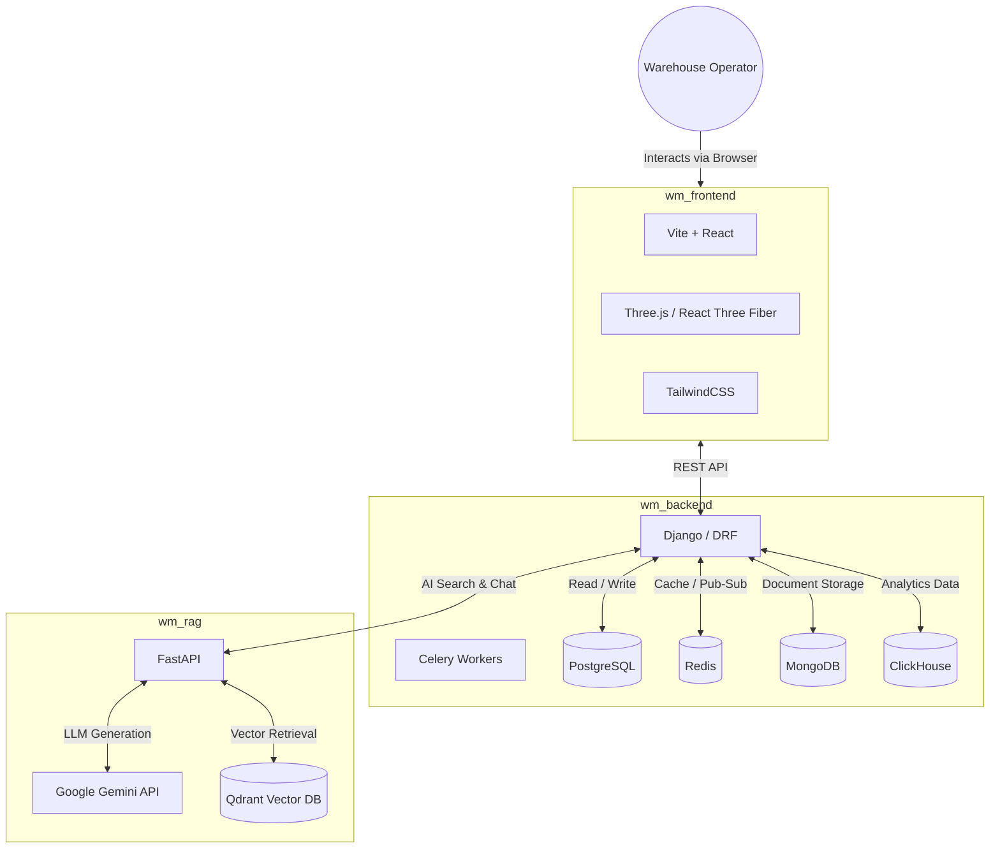

# System Architecture

The Warehouse Management System (WMS) is a modernized, full-stack application composed of three primary microservices/applications, designed to handle warehouse operations, inventory tracking, a 3D digital twin, and an AI-powered Retrieval-Augmented Generation (RAG) assistant.

## High-Level Architecture

## System Components

### 1. Frontend (`wm_frontend`)
A React application powered by Vite. It provides the user interface for warehouse operators and managers.
- **Key Tech:** React 18, Vite, TailwindCSS, React Router.
- **Digital Twin:** Uses `@react-three/fiber` and `@react-three/drei` to render a 3D digital twin of the warehouse layout, showing real-time bin occupancies and navigation routes.
- **Communication:** Communicates with the Django Backend via REST API over HTTP.

### 2. Core Backend (`wm_backend`)
A monolithic Django backend that acts as the source of truth for the system's business logic.
- **Key Tech:** Python 3.10+, Django, Django REST Framework.
- **Responsibilities:**
  - Authentication & Authorization
  - Inventory management (Products, Bins, Racks, Zones)
  - Order tracking and task assignment
  - Pathfinding algorithms (NetworkX shortest path for digital twin)
  - OCR integration and audit trails
- **Databases:**
  - **PostgreSQL:** Primary relational database (Users, Products, Orders, Layouts).
  - **Redis:** Caching layer and queue backend.
  - **MongoDB:** Flexible document store (used for complex logs or audit history).
  - **ClickHouse:** High-performance analytical database for processing warehouse analytics and heatmaps.

### 3. AI / RAG Service (`wm_rag`)
A dedicated Python microservice built with FastAPI to handle intelligent search and generative AI tasks.
- **Key Tech:** FastAPI, Sentence-Transformers (`all-mpnet-base-v2`), Qdrant, Google Gemini.
- **Responsibilities:**
  - Ingests and chunks warehouse documents (SOPs, Stock Reports, manuals).
  - Generates embeddings and stores them in Qdrant.
  - Performs hybrid similarity search and custom reranking (based on word overlap and warehouse taxonomy).
  - Connects to Google Gemini to synthesize human-readable answers from the retrieved context.
- **Communication:** Called by the Django backend when an AI query is triggered by the user.

## Data Flow Example: AI Query
1. **User** asks a question in the **Frontend** ("Where is SKU123?").
2. **Frontend** sends a POST request to the **Backend** (`/api/recommendations/ask`).
3. **Backend** authenticates the user, enriches the payload with user context, and forwards it to the **RAG Service** (`/api/ai/analyze`).
4. **RAG Service** embeds the query, searches **Qdrant**, retrieves chunks, calls **Gemini**, and returns the JSON payload.
5. **Backend** receives the result, logs the AI interaction to **MongoDB**, and returns the answer to the **Frontend**.
6. **Frontend** displays the result to the **User**.
